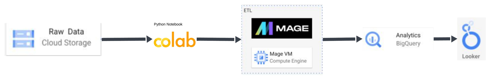
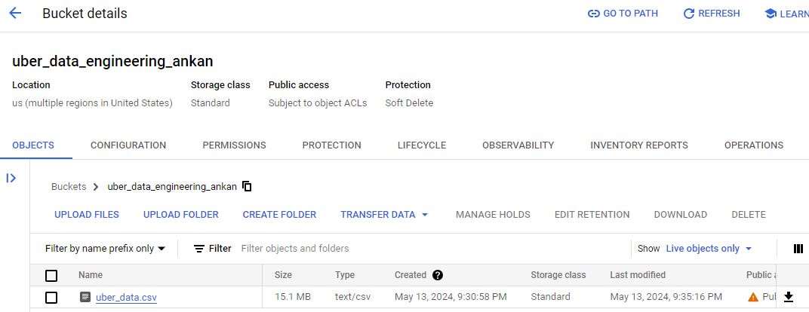
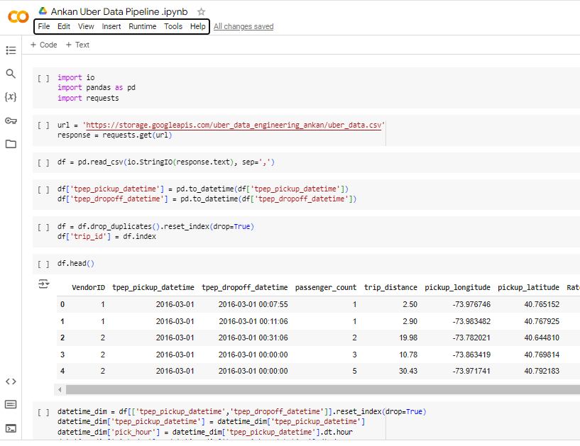
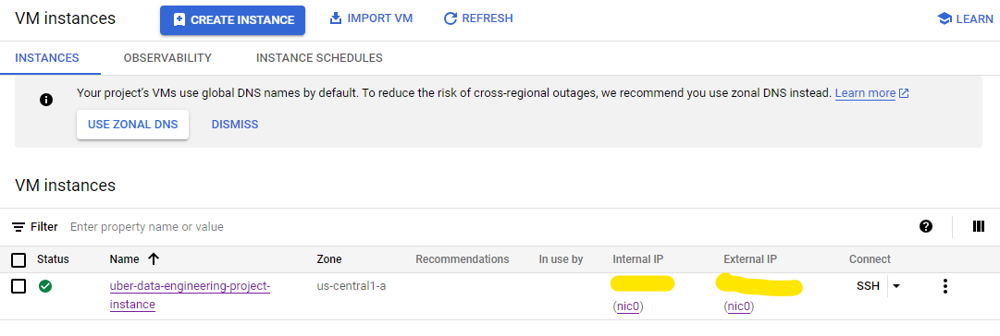
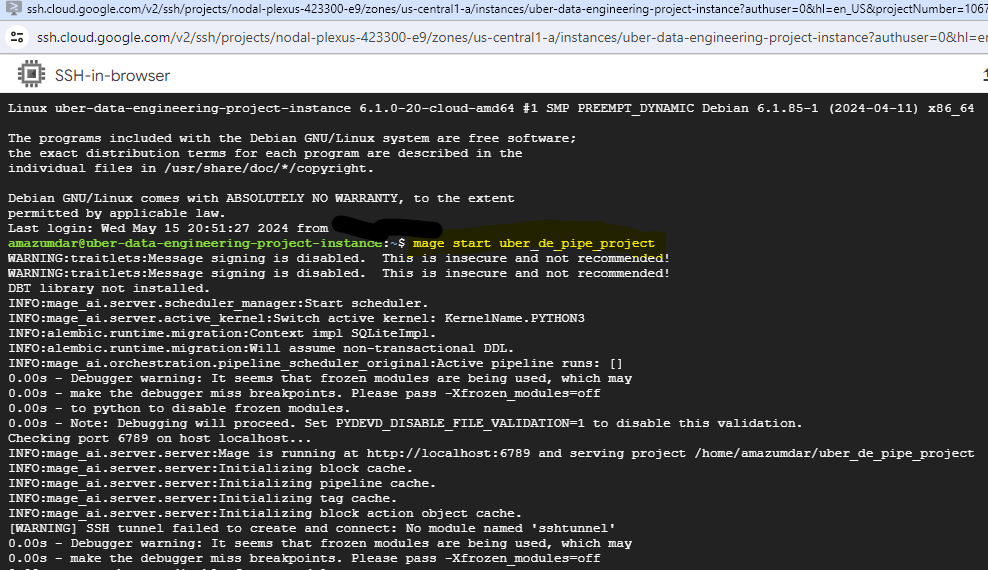
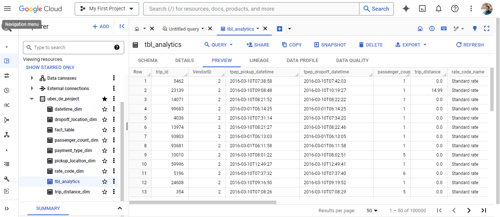
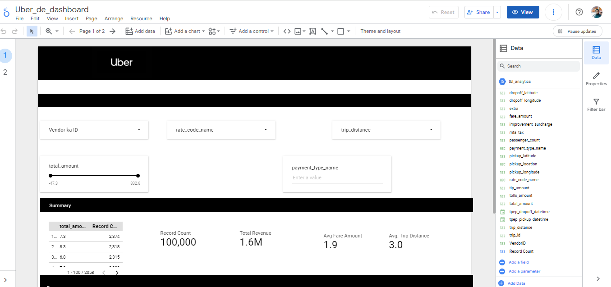
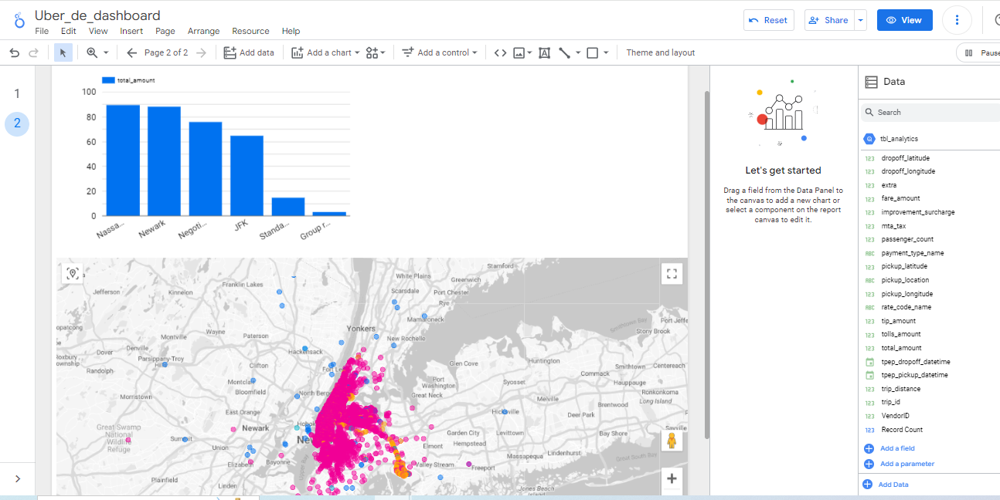

# Uber Data Analytics |  Data Engineering GCP Project

## Introduction

The goal of this project is to perform data analytics on Uber data using various tools and technologies, including GCP Storage, Python, Compute Instance, Mage Data Pipeline Tool, BigQuery, and Looker Studio.

## Architecture 

## Technology Used
- Programming Language - Python

Google Cloud Platform
1. Google Storage
2. Compute Instance 
3. BigQuery
4. Looker Studio

Modern Data Pipeine Tool - https://www.mage.ai/
Contibute to this open source project - https://github.com/mage-ai/mage-ai

Looker dashboard Link- https://lookerstudio.google.com/reporting/6f7ba70f-d77c-4f51-a9a3-2ea702b2a4fb

## Dataset Used
TLC Trip Record Data
Yellow and green taxi trip records include fields capturing pick-up and drop-off dates/times, pick-up and drop-off locations, trip distances, itemized fares, rate types, payment types, and driver-reported passenger counts. 
Here is the dataset used in the video - https://github.com/ankan-mazumdar/Ankan-uber-etl-pipeline-data-engineering-project/blob/main/data/uber_data.csv
More info about dataset for analysis:
1. Website - https://www.nyc.gov/site/tlc/about/tlc-trip-record-data.page
2. Data Dictionary - https://www.nyc.gov/assets/tlc/downloads/pdf/data_dictionary_trip_records_yellow.pdf

## Data Model

## Bucket Creation and csv file upload

## Data Preprocessing and Analysis in notebook

## Compute Engine- VM instances for Mage connection

## SSH Launch through public IP for Mage start 

## Mage-ai UI for ETL

## Data loaded from Bucket to BQ using Mage-ai

## Creating Looker Dashboard using BQ Table as source

## Complete Video Tutorial 
Video Link - Coming soon
